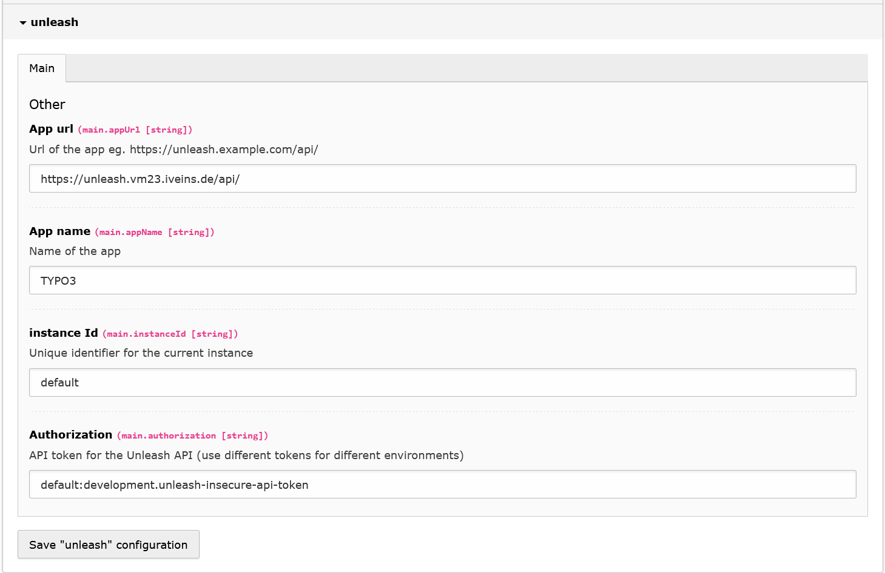

# EXT:unleash

TYPO3 extension to integrate the [Unleash](https://www.getunleash.io/) feature toggle service.

## installation

`composer require andersundsehr/unleash`

Set configuration in the extension settings:

## Configuration

Required are the `appUrl` and in most cases `authorization` (if you use the hosted unleash service)




## Usage

### TypoScript Condition

you can use the custom TypoScript condition `unleash` to check if a feature is enabled.

````ts
page.19 = TEXT
page.19.value = Feature 0 is disabled<br>
[unleash('feature0', false)]
    page.19.value = Feature 0 is enabled<br>
[end]

page.20 = TEXT
page.20.value = Feature 1 is disabled<br>
[unleash('feature1')]
    page.20.value = Feature 1 is enabled<br>
[end]

page.21 = TEXT
page.21.value = Feature 2 is disabled<br>
[unleash('feature2', true)]
    page.21.value = Feature 2 is enabled<br>
[end]
````

if you want to check A/B/n flags, you can use the `unleashVariant` condition.

````ts
page.22 = TEXT
[unleashVariant('feature3') === 'A']
    page.22.value = Feature 3 is set to A enabled<br>
[end]
[unleashVariant('feature3') === 'B']
    page.22.value = Feature 3 is set to B enabled<br>
[end]
[!unleashVariant('feature3')]
    page.22.value = Feature 3 is disabled<br>
[end]
````

### Fluid ViewHelper

if you want to check if a feature is enabled in your Fluid templates, you can use the `unleash:isEnabled` ViewHelper.

````html
{namespace unleash=Andersundsehr\Unleash\ViewHelpers}

<unleash:isEnabled feature="my-feature" default="false">
    <f:then>
        <p>Feature is enabled</p>
    </f:then>
    <f:else>
        <p>Feature is disabled</p>
    </f:else>
</unleash:isEnabled>

{unleash:isEnabled(feature: 'my-feature', default: false, then: 'Feature is enabled', else: 'Feature is disabled')}
````

if you want to check A/B/n flags, you can use the `unleash:getVariant` ViewHelper.

````html
{namespace unleash=Andersundsehr\Unleash\ViewHelpers}

<f:switch expression="{unleash:getVariant(feature: 'my-feature')}">
    <f:case value="A"><f:render section="A"/></f:case>
    <f:case value="B"><f:render section="B"/></f:case>
    <f:defaultCase>If is disabled</f:defaultCase>
</f:switch>
````


### PHP

you can inject the `Unleash` service into your classes and use it like this:

The configuration and Context will already be set up for you.

for more detailed usage information, please refer to the [Unleash PHP SDK Documentation](https://docs.getunleash.io/reference/sdks/php)

````php
use Unleash\Client\Unleash;

class Controller
{
    public function __construct(private Unleash $unleash) {}

    public function index()
    {
        if ($this->unleash->isEnabled('my-feature')) {
            // do something
        }
    }
}
````

or you can use GeneralUtility to get the Unleash instance

````php
use TYPO3\CMS\Core\Utility\GeneralUtility;
use Unleash\Client\Unleash;

GeneralUtility::makeInstance(Unleash::class)->isEnabled('my-feature');
````

## CustomContext

with this extension you have the possiblity to constrain the feature toggles to specific users, or admins, or logged in users.  
backend and frontend:  

- `backendUser.isLoggedIn`
- `backendUser.id`
- `backendUser.username`
- `backendUser.isAdmin`
- `frontendUser.isLoggedIn`
- `frontendUser.id`
- `frontendUser.username`
- `frontendUser.isAdmin`

## Extending with Events

you can extend the functionality of the Extension by using the following events.

### UnleashBuilderBeforeBuildEvent

Event that is dispatched right before the UnleashBuilder is built (`->build()`).
 
````php
use Andersundsehr\Unleash\Event\UnleashBuilderBeforeBuildEvent;

class UnleashBuilderBeforeBuildEventListener
{
    public function __invoke(UnleashBuilderBeforeBuildEvent $event)
    {
        $event->builder = $event->builder
            ->withAppName('my-custom-app-name');
    }
}
````

### UnleashCustomContextEvent

This event is dispatched when the Unleash context is created.  
use this if you only want to overwrite or add customContext data  
if you want to change anything else, use the `UnleashContextCreatedEvent`

````php
use Andersundsehr\Unleash\Event\UnleashCustomContextEvent;

class UnleashCustomContextEventListener
{
    public function __invoke(UnleashCustomContextEvent $event)
    {
        $event->customContext['fair'] = 'value';
    }
}
````

### UnleashContextCreatedEvent

Event that is dispatched right after the UnleashContext is created with all the default values.  
Will be called multiple times, once per `->isEnabled` or `->getVariant` call.

````php
use Andersundsehr\Unleash\Event\UnleashContextCreatedEvent;

class UnleashContextCreatedEventListener
{
    public function __invoke(UnleashContextCreatedEvent $event)
    {
        $event->context->setHostname('my-custom-hostname');
    }
}
````

# with ♥️ from anders und sehr GmbH

> If something did not work 😮  
> or you appreciate this Extension 🥰 let us know.

> We are hiring https://www.andersundsehr.com/karriere/

